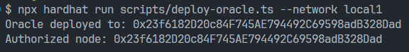
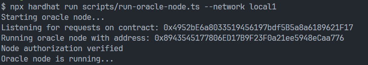

# Property_Administration_dApp

## Description
Property Administration dApp adalah aplikasi berbasis blockchain untuk mengatasi masalah  manajemen kepemilikan dan riwayat transaksi properti bangunan atau pun tanah.

## System Requirement
1. Docker: https://www.docker.com/
2. Geth: https://geth.ethereum.org/
3. Kurtosis: https://www.kurtosis.com/
4. Node.js: https://nodejs.org/en

## How to Run Private Chain
1. Memastikan Docker telah terinstall dan dijalankan. Gunakan command `docker --version` untuk memastikan Docker sedang berjalan.
2. Memastikan Kurtosis telah terinstall. Gunakan command `kurtosis version` untuk memastikan instalasi Kurtosis berhasil.
3. Gunakan command `kurtosis run github.com/ethpandaops/ethereum-package --args-file ./network_params.yaml --image-download always` untuk menjalankan Private Chain.
4. Berikut contoh tampilan yang muncul jika Private Chain berhasil dijalankan.


## How to Deploy Smart Contract
1. Gunakan command berikut untuk melakukan instalasi dependencies.
```
cd smart-contract
npm install
```
2. Menjalankan Private Chain sesuai panduan di atas dan menyesuaikan konfigurasi hardhat.config.ts.
3. Berikut contoh tampilan konfigurasi hardhat.config.ts berdasarkan Private Chain.


4. Gunakan command berikut untuk melakukan deployment Smart Contract.
```
npx hardhat compile
npx hardhat run scripts/deploy-property-registry.ts --network local1
```
5. Berikut contoh tampilan yang muncul jika Smart Contract berhasil dideploy.


## How to Deploy and Integrate Oracle
Pastikan anda berada pada direktori `<root>/smart-contract`, kemudian ikuti langkah berikut.
1. Gunakan command berikut untuk melakukan deployment Smart Contract Oracle.
```
npx hardhat run scripts/deploy-oracle.ts --network local1
```
2. Gunakan command berikut untuk menjalankan off-chain oracle node.
```
npx hardhat run scripts/run-oracle-node.ts --network local1
```
3. Berikut contoh tampilan yang muncul jika Oracle berhasil di deploy.



4. Address dari oracle yang telah di deploy, dapat diganti pada source code `<root>/smart-contract/scripts/run-oracle-node.ts`.

5. Berikut contoh tampilan yang muncul jika Oracle Node berhasil dijalankan.



## How to Run External API
Pastikan anda berada pada direktori `<root>/tax-counter-API`, selanjutnya jalankan command berikut.
```
npm run dev
```

## Video Demonstration
Link Video: 