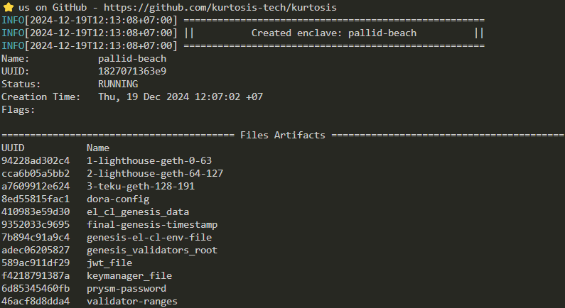
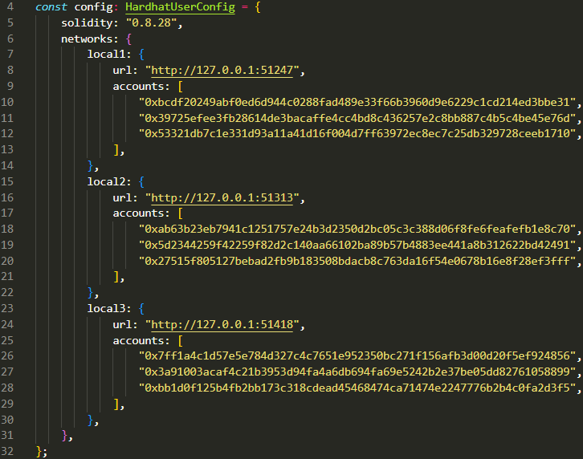
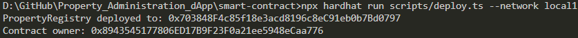

# Property_Administration_dApp

## Description
Property Administration dApp adalah aplikasi berbasis blockchain untuk mengatasi masalah  manajemen kepemilikan dan riwayat transaksi properti bangunan atau pun tanah.

## System Requirement
1. Docker: https://www.docker.com/
2. Geth: https://geth.ethereum.org/
3. Kurtosis: https://www.kurtosis.com/
4. Node.js: https://nodejs.org/en

## How to Run Private Chain
1. Memastikan Docker telah terinstall dan dijalankan. Gunakan command `docker --version` untuk memastikan Docker sedang berjalan.
2. Memastikan Kurtosis telah terinstall. Gunakan command `kurtosis version` untuk memastikan instalasi Kurtosis berhasil.
3. Gunakan command `kurtosis run github.com/ethpandaops/ethereum-package --args-file ./network_params.yaml --image-download always` untuk menjalankan Private Chain.
4. Berikut contoh tampilan yang muncul jika Private Chain berhasil dijalankan.



## How to Deploy Smart Contract
1. Gunakan command `cd smart-contract` dan `npm install` untuk melakukan instalasi dependencies.
2. Menjalankan Private Chain sesuai panduan di atas dan menyesuaikan konfigurasi hardhat.config.ts.
3. Berikut contoh tampilan konfigurasi hardhat.config.ts berdasarkan Private Chain.



4. Gunakan command berikut untuk melakukan deployment Smart Contract
```
npx hardhat compile
npx hardhat run scripts/deploy.ts --network local1
```
5. Berikut contoh tampilan yang muncul jika Smart Contract berhasil dideploy.



## How to Deploy and Integrate Oracle

## Video Demonstration
